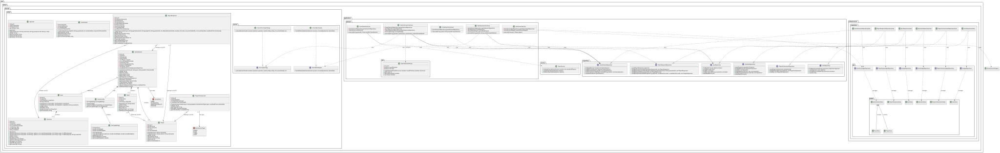

# 🦉 Kubou - Plateforme d'Évaluation & Gamification

> **Learning made Fun & Data-Driven.**
> Kubou est une plateforme interactive d'apprentissage qui transforme l'évaluation en expérience gamifiée, tout en offrant aux enseignants des outils d'analyse paramétriques avancés.

[](https://github.com/Buco7854/kubou/actions)
[](https://sonarcloud.io/summary/new_code?id=Buco7854_kubou)

## Outils Similaires / Concurrents

* Wooclap
* Kahoot

## 📋 Gestion de Projet

Le suivi des tâches et l'évolution du projet sont gérés via un tableau Kanban GitHub Projects.

👉 **[Accéder au Kanban du Projet](https://github.com/users/Buco7854/projects/2)**

## ✨ Fonctionnalités Clés (Core Features)

Le projet s'articule autour de 8 features majeurs :

### 1. 🔄 Cycle de Vie & Temps Réel
* Gestion complète des sessions de jeu (Lobby, Questions, Résultats).
* Calcul en temps réel des moyennes pondérées par utilisateur.
* Synchronisation instantanée via WebSockets.

### 2. 🧮 Moteur de Notation Hybride (Strategy Pattern)
* Système flexible permettant au professeur de définir sa propre formule de notation.
* **Critères pondérables :** Justesse, Temps de réponse (Vitesse), et Séries de victoires (Streak).
* Implémentation via le pattern *Strategy* pour injecter des règles de calcul dynamiques.

### 3. 📊 Analytique "Boîte Noire" (Parametric Analytics)
* Module de construction de graphiques à la demande.
* L'utilisateur fournit les paramètres d'entrée (Période, Sujet, Cible) et le système génère la visualisation adéquate.
* **Sorties :** Courbes d'évolution, Radar de compétences, Taux d'abandon/Rétention.

### 4. 🏆 Gamification Événementielle
* Système basé sur des *Event Listeners* pour débloquer des succès.
* **Badges exemples :** "Sniper" (5 réponses justes d'affilée), "Flash" (réponse < 1s).
* Renforcement positif pour maintenir l'engagement.

### 5. ⚔️ Mode Team Battle
* Compétition "Groupe contre Groupe".
* Agrégation des scores individuels pour calculer un score d'équipe unifié en temps réel.

### 6. 🧠 Smart Review (Révision Intelligente)
* Génération automatique de "Quiz de Rattrapage".
* Analyse l'historique des échecs pour proposer un contenu ciblé sur les lacunes de l'élève.

### 7. 📥 Import depuis des API de Quiz Externes
* Import de questions depuis plusieurs sources externes : **Open Trivia DB** (anglais), **QuizzAPI** (français), **QuizAPI** (anglais tech/dev).
* Sélection de la catégorie, du nombre de questions et de la langue cible.
* Traduction automatique des questions si la langue source diffère de la langue cible.
* Architecture extensible via le pattern *Provider Factory* permettant d'ajouter facilement de nouvelles sources.

### 8. 🤖 Création de Quiz par IA (OpenAI)
* Génération automatique de questions à choix multiples à partir d'un texte libre grâce à l'API OpenAI.
* L'utilisateur colle un texte (cours, article, notes) et l'IA génère un quiz personnalisé.
* Sélection de la langue des questions parmi les langues supportées par l'application.
* Configuration flexible via variables d'environnement : `OPENAI_API_KEY`, `OPENAI_BASE_URL`, `OPENAI_MODEL`.
* Compatible avec tout endpoint compatible OpenAI (OpenAI, Azure OpenAI, modèles locaux via LM Studio, etc.).

## 🏗️ Architecture Technique

Le projet respecte les principes de la **Clean Architecture** pour isoler la logique métier complexe.

### Structure des Packages
* **`domain`**: Le cœur. Contient les Entités (`GameSession`, `Player`) et les Interfaces (`IScoringStrategy`). Aucune dépendance externe (Framework agnostic).
* **`application`**: La logique applicative. Contient les Use Cases (`SubmitAnswerUseCase`) et les Services (`AchievementService`). Orchestre les flux de données.
* **`infrastructure`**: Les détails techniques. Implémentation des Repositories (JPA/Hibernate), Configuration WebSocket, Sécurité (JWT).
* **`interface_adapter`**: La couche de présentation. Contrôleurs REST (`QuizController`) et Contrôleurs WebSocket (`GameController`).

### Diagramme de Classe UML

Voici une vue d'ensemble de la structure des classes du projet.



## 📘 Guide Technique Détaillé & Flux de Données

Cette section décortique le fonctionnement interne de l'application pour la présentation technique.

### 1. Protocoles de Communication
L'application utilise deux modes de communication distincts :
*   **HTTP REST (Stateless)** : Pour la gestion des ressources (Création de Quiz, Login, Historique).
*   **WebSocket STOMP (Stateful)** : Pour le déroulement du jeu en temps réel.

**Lexique WebSocket (STOMP) :**
*   `@MessageMapping` (Prefix `/app`) : Message envoyé du **Client vers le Serveur** (Action).
*   `@SendTo` / `SimpMessagingTemplate` (Prefix `/topic`) : Message diffusé du **Serveur vers Tous les Clients** (Broadcast).
*   `convertAndSendToUser` (Prefix `/user/queue`) : Message envoyé du **Serveur vers Un Client Spécifique** (Privé).

---

### 2. Scénario : Le Cycle de Vie d'une Partie (Game Loop)

Voici le détail technique de ce qui se passe "sous le capot" lors d'une partie.

#### Phase A : Initialisation (REST)
1.  Le professeur crée la partie via **HTTP POST** `/api/v1/games`.
    *   *Classe :* `GameCreationController`.
    *   *Action :* Le `CreateGameUseCase` instancie une `GameSession`, génère un PIN unique et sauvegarde en BDD.

#### Phase B : Le Lobby (WebSocket)
1.  L'élève rejoint via **WebSocket** en envoyant un message sur `/app/lobby/join`.
    *   *Payload :* `{ pin: "123456", token: "..." }`.
2.  Le serveur ajoute le joueur et notifie tout le monde via `/topic/lobby/{pin}/players`.
    *   *Résultat :* La liste des joueurs se met à jour instantanément sur l'écran du prof.

#### Phase C : Le Jeu (Le cœur du système)

**1. Lancement de la question**
*   Le prof clique sur "Start".
*   **Client -> Serveur** : Envoi sur `/app/game/{id}/start`.
*   **Serveur -> Clients** : Diffusion sur `/topic/game/{id}/question`.
    *   *Note :* Le serveur envoie la question *sans* la bonne réponse aux élèves pour éviter la triche (inspection réseau).

**2. Soumission d'une réponse (Flux Critique)**
C'est ici que tout se joue.
*   **Client -> Serveur** : L'élève clique sur une réponse. Le message est envoyé sur la destination STOMP :
    > **`/app/game/{id}/submit`**
    > *(Ceci n'est PAS une requête HTTP, mais un message WebSocket)*
*   **Traitement Backend (`GameController` & `SubmitAnswerUseCase`)** :
    1.  Récupération de la session et du joueur.
    2.  **Validation Temporelle** : Vérification côté serveur que le temps n'est pas écoulé (Anti-cheat).
    3.  **Calcul du Score** : Appel à `IScoringStrategy.calculate()`.
        *   Prend en compte : La justesse, le temps restant, et le "Streak" (série de victoires).
    4.  **Persistance** : Création d'une `PlayerResponse` (Donnée brute pour l'analytique).
    5.  **Gamification** : Appel asynchrone à `AchievementService` pour vérifier si un badge (ex: "Sniper") doit être débloqué.

**3. Feedback Temps Réel**
Immédiatement après le calcul :
*   **Serveur -> Client (Privé)** : Envoi sur `/user/queue/result`.
    *   *Contenu :* "Tu as gagné +850 points". Seul l'élève concerné reçoit ce message.
*   **Serveur -> Host (Public)** : Envoi sur `/topic/game/{id}/host/answer_received`.
    *   *Action :* Le compteur "Réponses reçues" du prof s'incrémente.

#### Phase D : Fin de Manche & Leaderboard
1.  Une fois le temps écoulé ou tous les joueurs ayant répondu.
2.  **Serveur -> Clients** : Diffusion sur `/topic/game/{id}/answer`.
    *   *Contenu :* La bonne réponse est révélée.
3.  **Serveur -> Clients** : Diffusion sur `/topic/game/{id}/leaderboard`.
    *   *Contenu :* Le classement mis à jour (Top 5) et, si le mode équipe est actif, le score des équipes agrégé.

---

### 3. Zoom sur les Fonctionnalités "Intelligentes"

#### La "Smart Review" (Révision Intelligente)
*   **Problème :** Comment aider un élève qui a échoué ?
*   **Solution Technique :**
    1.  Appel **HTTP POST** `/api/v1/smart-review/generate`.
    2.  Le `SmartReviewService` interroge le `PlayerResponseRepository`.
    3.  Il filtre toutes les réponses où `isCorrect = false` (historique complet).
    4.  Il récupère les questions originales via `QuestionRepository`.
    5.  Il génère un nouvel objet `Quiz` (non persisté ou temporaire) contenant uniquement ces questions.

#### L'Analytique "Boîte Noire"
*   Toutes les actions sont logguées dans la table `PlayerResponse`.
*   Cela permet de reconstruire n'importe quelle statistique *a posteriori* (Taux d'erreur par question, temps moyen par joueur, etc.) sans avoir besoin de compteurs pré-calculés durant la partie.

## 💻 Démarrage (Environnement de Dev)

### Prérequis
* Docker & Docker Compose
* Java 21 (optionnel si via Docker)
* Node.js 20+ (pour le frontend local)

### Variables d'Environnement

| Variable | Description | Défaut |
|---|---|---|
| `SPRING_DATASOURCE_URL` | URL de la base PostgreSQL | `jdbc:postgresql://localhost:5432/kubou` |
| `APP_JWT_SECRET` | Secret JWT | *(dev secret)* |
| `QUIZAPI_KEY` | Clé API QuizAPI | - |
| `OPENAI_API_KEY` | Clé API OpenAI (requis pour la génération IA) | - |
| `OPENAI_BASE_URL` | URL de base de l'API OpenAI | `https://api.openai.com/v1` |
| `OPENAI_MODEL` | Modèle OpenAI à utiliser (requis) | - |

### Lancer le projet

1.  **Lancer l'infrastructure (Base de données)**
    ```bash
    docker-compose -f docker-compose.dev.yml up -d
    ```

2.  **Lancer le Backend**
    ```bash
    cd backend
    ./gradlew bootRun
    ```
    *API Docs (Swagger):* http://localhost:8080/swagger-ui/index.html

3.  **Lancer le Frontend**
    ```bash
    cd frontend
    npm install
    npm run dev
    ```
    *Application:* http://localhost:5173

## 👤 Contributeurs
[Insights](https://github.com/Buco7854/kubou/graphs/contributors).
